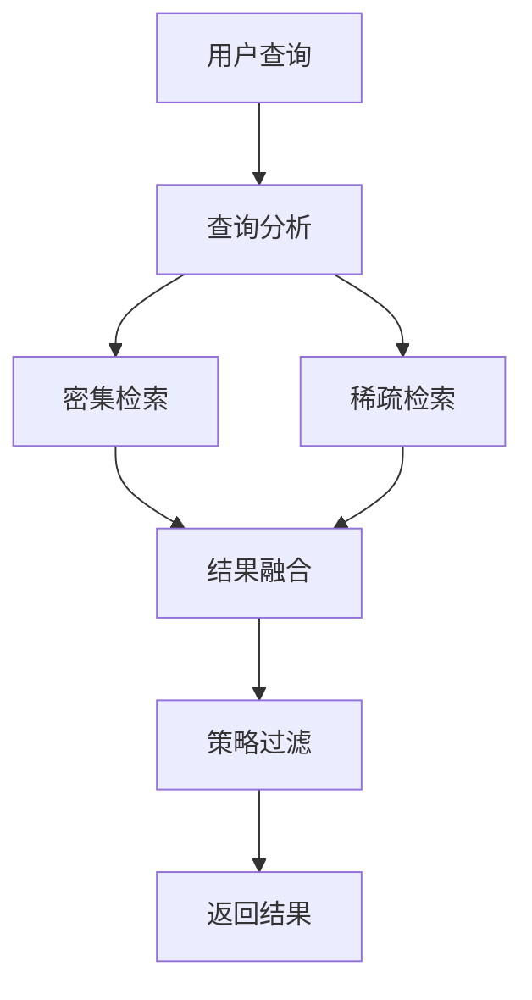

# LivingMemory 开发指南

本文档面向希望理解、扩展或贡献 LivingMemory 插件的开发者。

## 🏗️ 架构概览

### 核心设计理念

LivingMemory 插件基于 **三大引擎协作** 的架构模式：

```
用户对话 → 反思引擎 → 记忆存储
    ↑           ↓         ↓
回忆引擎 ←  记忆检索  ←  遗忘代理
```

### 目录结构

```
astrbot_plugin_livingmemory/
├── main.py                 # 插件入口点
├── requirements.txt        # 依赖列表
├── metadata.yaml          # 插件元信息
├── _conf_schema.json      # 配置模式
├── FUSION_STRATEGIES.md   # 融合策略文档
├── core/                  # 核心业务逻辑
│   ├── engines/          # 三大引擎
│   │   ├── reflection_engine.py    # 反思引擎
│   │   ├── recall_engine.py        # 回忆引擎
│   │   └── forgetting_agent.py     # 遗忘代理
│   ├── retrieval/        # 检索相关
│   │   ├── sparse_retriever.py     # 稀疏检索器
│   │   └── result_fusion.py        # 结果融合器
│   ├── models/           # 数据模型
│   │   ├── __init__.py
│   │   └── memory_models.py
│   ├── utils.py          # 工具函数
│   └── config_validator.py # 配置验证
├── storage/              # 存储层
│   ├── faiss_manager.py  # FAISS 管理器
│   └── memory_storage.py # 内存存储
└── docs/                 # 文档
    ├── CONFIG.md         # 配置参考
    ├── DEVELOPMENT.md    # 开发指南
    └── TROUBLESHOOTING.md # 故障排除
```

## 🧠 三大引擎详解

### 1. 反思引擎 (ReflectionEngine)

**职责**：对会话历史进行智能总结，提取关键事件并评估重要性

**核心流程**：
```python
async def reflect_and_store(
    self,
    conversation_history: List[Dict[str, str]],
    session_id: str,
    persona_id: Optional[str] = None,
    persona_prompt: Optional[str] = None
):
    # 1. 批量提取事件
    events = await self._extract_events_batch(conversation_history, persona_prompt)
    
    # 2. 批量评估重要性
    evaluated_events = await self._evaluate_events_batch(events)
    
    # 3. 存储有价值的记忆
    await self._store_memories(evaluated_events, session_id, persona_id)
```

**扩展点**：
- 自定义提示词模板
- 添加新的事件类型
- 实现多轮对话上下文理解

### 2. 回忆引擎 (RecallEngine)

**职责**：根据查询智能召回相关记忆

**核心流程**：
```python
async def recall(
    self,
    context,
    query: str,
    session_id: Optional[str] = None,
    persona_id: Optional[str] = None,
    k: int = None
) -> List[Result]:
    # 1. 多模式检索
    dense_results = await self._dense_search(query, k)
    sparse_results = await self._sparse_search(query, k) if self.sparse_retriever else []
    
    # 2. 结果融合
    fused_results = self.result_fusion.fuse(dense_results, sparse_results, k)
    
    # 3. 策略过滤和排序
    final_results = await self._apply_recall_strategy(fused_results, query)
    
    return final_results
```

**扩展点**：
- 添加新的检索模式
- 实现自定义融合策略
- 优化召回算法

### 3. 遗忘代理 (ForgettingAgent)

**职责**：模拟遗忘曲线，自动清理陈旧记忆

**核心流程**：
```python
async def _prune_memories(self):
    # 1. 分页加载记忆
    async for batch in self.faiss_manager.get_memories_paginated(batch_size):
        # 2. 计算衰减后的重要性
        for memory in batch:
            decayed_importance = self._calculate_decayed_importance(memory)
            
        # 3. 标记需要删除的记忆
        memories_to_delete = self._identify_forgettable_memories(batch)
        
        # 4. 批量删除
        if memories_to_delete:
            await self.faiss_manager.delete_memories(memories_to_delete)
```

**扩展点**：
- 实现复杂的遗忘曲线
- 添加记忆重要性动态调整
- 支持记忆归档而非删除

## 🔍 检索系统架构

### 混合检索流程



### 融合策略系统

结果融合器支持 9 种融合策略，采用策略模式实现：

```python
class ResultFusion:
    def fuse(self, dense_results, sparse_results, k, query_info=None):
        if self.strategy == "rrf":
            return self._rrf_fusion(dense_results, sparse_results, k)
        elif self.strategy == "adaptive":
            return self._adaptive_fusion(dense_results, sparse_results, k, query_info)
        # ... 其他策略
```

**添加新融合策略**：

1. 在 `ResultFusion` 类中添加新方法：
```python
def _my_custom_fusion(self, dense_results, sparse_results, k):
    # 实现你的融合逻辑
    pass
```

2. 在 `fuse` 方法中添加策略分支
3. 更新配置验证器中的策略列表
4. 添加相应的测试用例

## 💾 存储层设计

### FaissManager

**职责**：高级数据库管理，提供事务安全的操作接口

**核心功能**：
- 分页查询：`get_memories_paginated()`
- 批量删除：`delete_memories()`
- 记忆更新：`update_memory()`
- 统计信息：`count_total_memories()`

**事务安全**：
```python
async def delete_memories(self, memory_ids: List[int]) -> Dict[str, Any]:
    # 开始事务
    await self.db.document_storage.begin_transaction()
    
    try:
        # 执行删除操作
        deleted_count = await self._perform_deletion(memory_ids)
        
        # 提交事务
        await self.db.document_storage.commit_transaction()
        
        return {"success": True, "deleted_count": deleted_count}
        
    except Exception as e:
        # 回滚事务
        await self.db.document_storage.rollback_transaction()
        raise e
```

### 数据模型设计

使用 Pydantic v2 进行数据验证：

```python
class MemoryEvent(BaseModel):
    """单个记忆事件"""
    memory_content: str = Field(..., description="记忆内容")
    event_type: str = Field(default="OTHER", description="事件类型")
    importance: Optional[float] = Field(default=None, description="重要性评分")

    model_config = {"extra": "allow"}
```

## 🎛️ 配置系统

### 配置验证框架

采用 Pydantic v2 构建类型安全的配置系统：

```python
class LivingMemoryConfig(BaseModel):
    session_manager: SessionManagerConfig = Field(default_factory=SessionManagerConfig)
    recall_engine: RecallEngineConfig = Field(default_factory=RecallEngineConfig)
    # ... 其他配置
    
    @field_validator('similarity_weight', 'importance_weight', 'recency_weight')
    @classmethod
    def validate_weights_sum(cls, v, info):
        # 权重验证逻辑
        return v
```

### 配置热更新

插件支持运行时配置更新：

```python
@lmem_group.command("fusion")
async def lmem_fusion(self, event, strategy: str = "show", param: str = ""):
    # 更新融合策略
    self.config["fusion"]["strategy"] = strategy
    
    # 同步到引擎
    if hasattr(self.recall_engine, 'result_fusion'):
        self.recall_engine.result_fusion.strategy = strategy
```

## 🔌 插件集成

### AstrBot 事件钩子

```python
@filter.on_llm_request()
async def handle_memory_recall(self, event: AstrMessageEvent, req: ProviderRequest):
    # LLM 请求前：注入记忆
    recalled_memories = await self.recall_engine.recall(...)
    if recalled_memories:
        memory_str = format_memories_for_injection(recalled_memories)
        req.system_prompt = memory_str + "\n" + req.system_prompt

@filter.on_llm_response() 
async def handle_memory_reflection(self, event: AstrMessageEvent, resp: LLMResponse):
    # LLM 响应后：检查是否需要反思
    if should_trigger_reflection(...):
        asyncio.create_task(self.reflection_engine.reflect_and_store(...))
```

### 命令系统

使用 AstrBot 的命令组功能：

```python
@filter.command_group("lmem")
def lmem_group(self):
    """长期记忆管理命令组"""
    pass

@lmem_group.command("search")
async def lmem_search(self, event: AstrMessageEvent, query: str, k: int = 3):
    # 命令实现
    pass
```

## 🧪 测试框架

### 单元测试结构

```
tests/
├── test_engines/
│   ├── test_reflection_engine.py
│   ├── test_recall_engine.py
│   └── test_forgetting_agent.py
├── test_retrieval/
│   ├── test_sparse_retriever.py
│   └── test_result_fusion.py
├── test_storage/
│   └── test_faiss_manager.py
├── test_config/
│   └── test_config_validator.py
└── conftest.py
```

### 测试数据准备

```python
@pytest.fixture
def sample_memories():
    return [
        {
            "content": "用户喜欢吃苹果",
            "metadata": {
                "importance": 0.8,
                "event_type": "PREFERENCE",
                "create_time": time.time()
            }
        },
        # ... 更多测试数据
    ]
```

### 集成测试

```python
async def test_full_memory_lifecycle():
    # 1. 创建插件实例
    plugin = LivingMemoryPlugin(context, config)
    await plugin._wait_for_initialization()
    
    # 2. 模拟对话触发反思
    conversation = [
        {"role": "user", "content": "我喜欢吃苹果"},
        {"role": "assistant", "content": "好的，我记住了您喜欢吃苹果"}
    ]
    await plugin.reflection_engine.reflect_and_store(conversation, "test_session")
    
    # 3. 测试记忆召回
    results = await plugin.recall_engine.recall(context, "用户的饮食偏好", "test_session")
    assert len(results) > 0
    assert "苹果" in results[0].data["text"]
    
    # 4. 测试遗忘机制
    await plugin.forgetting_agent._prune_memories()
```

## 🚀 性能优化

### 异步编程最佳实践

```python
# 好的做法：并发执行无依赖操作
async def parallel_operations():
    dense_task = asyncio.create_task(dense_search(query))
    sparse_task = asyncio.create_task(sparse_search(query))
    
    dense_results = await dense_task
    sparse_results = await sparse_task
    return fuse_results(dense_results, sparse_results)

# 避免：串行执行
async def serial_operations():
    dense_results = await dense_search(query)  # 等待完成
    sparse_results = await sparse_search(query)  # 再等待完成
    return fuse_results(dense_results, sparse_results)
```

### 内存管理

```python
# 分页处理大数据集
async def process_large_dataset():
    batch_size = 1000
    async for batch in get_memories_paginated(batch_size):
        await process_batch(batch)
        # 每批处理完成后，Python GC 会回收内存
```

### 缓存策略

```python
from functools import lru_cache

class RecallEngine:
    @lru_cache(maxsize=128)
    def _compute_weights(self, query_hash: str) -> Tuple[float, float, float]:
        # 缓存权重计算结果
        return self._calculate_weights(query_hash)
```

## 🔧 开发工作流

### 1. 开发环境设置

```bash
# 克隆项目
git clone https://github.com/lxfight/astrbot_plugin_livingmemory.git

# 安装依赖
pip install -r requirements.txt
pip install -r requirements-dev.txt  # 开发依赖

# 设置 pre-commit hooks
pre-commit install
```

### 2. 代码规范

- **代码风格**：遵循 PEP 8
- **类型注解**：使用 typing 模块提供完整类型信息
- **文档字符串**：使用 Google 风格的 docstring
- **错误处理**：提供详细的异常信息和日志

### 3. 提交规范

使用语义化提交信息：

```
feat: 添加新的融合策略 hybrid_rrf
fix: 修复稀疏检索中文分词问题
docs: 更新配置文档
test: 添加回忆引擎单元测试
refactor: 重构存储层事务处理
perf: 优化大规模数据的分页查询
```

### 4. 发布流程

```bash
# 1. 更新版本号
# 修改 metadata.yaml 中的版本信息

# 2. 更新 CHANGELOG
# 记录新功能、修复和改进

# 3. 创建发布分支
git checkout -b release/v1.2.0

# 4. 运行完整测试套件
pytest tests/ --cov=.

# 5. 创建 Pull Request
# 经过 Code Review 后合并到主分支

# 6. 创建 Git Tag
git tag -a v1.2.0 -m "Release v1.2.0: 添加分页与核爆功能"
git push origin v1.2.0
```

## 🎯 扩展指南

### 添加新的检索模式

1. **在 RecallEngine 中添加新方法**：
```python
async def _graph_search(self, query: str, k: int) -> List[Result]:
    # 实现基于知识图谱的检索
    pass
```

2. **更新配置验证器**：
```python
retrieval_mode: str = Field(
    default="hybrid", 
    pattern="^(hybrid|dense|sparse|graph)$", 
    description="检索模式"
)
```

3. **添加命令支持**：
```python
@lmem_group.command("search_mode")
async def lmem_search_mode(self, event, mode: str):
    valid_modes = ["hybrid", "dense", "sparse", "graph"]
    # ... 实现逻辑
```

### 实现自定义记忆类型

1. **扩展事件类型**：
```python
class EventType(Enum):
    FACT = "FACT"
    PREFERENCE = "PREFERENCE" 
    GOAL = "GOAL"
    OPINION = "OPINION"
    RELATIONSHIP = "RELATIONSHIP"
    SKILL = "SKILL"  # 新增技能记忆
    HABIT = "HABIT"  # 新增习惯记忆
```

2. **更新提示词模板**：
```python
ENHANCED_EXTRACTION_PROMPT = """
提取以下类型的记忆事件：
- SKILL: 用户掌握的技能或能力
- HABIT: 用户的日常习惯或行为模式
...
"""
```

### 集成外部知识库

```python
class ExternalKnowledgeConnector:
    def __init__(self, api_endpoint: str, api_key: str):
        self.api_endpoint = api_endpoint
        self.api_key = api_key
    
    async def enrich_memory(self, memory_content: str) -> Dict[str, Any]:
        # 调用外部API增强记忆内容
        pass

class EnhancedReflectionEngine(ReflectionEngine):
    def __init__(self, *args, knowledge_connector=None, **kwargs):
        super().__init__(*args, **kwargs)
        self.knowledge_connector = knowledge_connector
    
    async def _enrich_memories(self, memories: List[Dict]) -> List[Dict]:
        if self.knowledge_connector:
            for memory in memories:
                enhancement = await self.knowledge_connector.enrich_memory(
                    memory["content"]
                )
                memory["metadata"].update(enhancement)
        return memories
```

## 🎉 贡献指南

### 贡献类型

1. **代码贡献**
   - 新功能实现
   - Bug 修复
   - 性能优化
   - 代码重构

2. **文档贡献**
   - API 文档完善
   - 使用教程编写
   - 最佳实践总结

3. **测试贡献**
   - 单元测试补充
   - 集成测试编写
   - 性能基准测试

### Pull Request 检查清单

- [ ] 代码遵循项目规范
- [ ] 添加了适当的测试用例
- [ ] 更新了相关文档
- [ ] 通过了所有 CI 检查
- [ ] 提供了清晰的提交信息

### 社区交流

- **GitHub Issues**: 报告 bug 和功能请求
- **GitHub Discussions**: 技术讨论和使用交流
- **Pull Requests**: 代码贡献和 Review

## 📚 参考资源

### 相关技术文档
- [AstrBot 插件开发指南](https://github.com/Soulter/AstrBot)
- [Pydantic v2 文档](https://docs.pydantic.dev/)
- [FAISS 官方文档](https://faiss.ai/)
- [异步编程最佳实践](https://docs.python.org/3/library/asyncio.html)

### 学术论文
- "Reciprocal Rank Fusion outperforms Condorcet and individual Rank Learning Methods"
- "BM25 and Beyond: Information Retrieval Models"
- "The Forgetting Curve: Hermann Ebbinghaus and the Science of Memory"

---

希望这份开发指南能够帮助您理解和扩展 LivingMemory 插件。如果您有任何问题或建议，欢迎通过 GitHub Issues 与我们交流！
